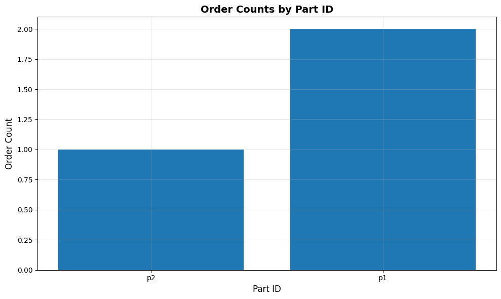

# Query Kafka with SQL

Prompt:
```
Create a table for topic 'lineitem'. Then select from the topic table 'lineitem' for rows of order id 'o1'.
```

Agent:
```
Final model: result="Table for topic 'lineitem' created successfully. Query result: [
    ('2025-10-27T21:43:45.695571', 'o1', 'p1'), 
    ('2025-10-27T21:43:45.916527', 'o1', 'p2')
]"
```

Prompt:
```
Query the lineimte topic for order counts by part_id and show me a bar chart
```
Agent:
```
result='file:///tmp/tmpr_9y4bri.png'
```

